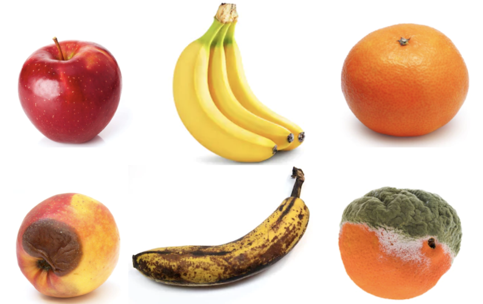

# 🍎 Fruit Freshness Classifier using VGG16

This project focuses on building a deep learning model that classifies fruits into six categories based on their type and freshness using image data.

- Fresh Apples
- Fresh Oranges
- Fresh Bananas
- Rotten Apples
- Rotten Oranges
- Rotten Bananas

The goal was to develop a highly accurate image classification model, aiming for at least 92% validation accuracy — and I'm excited to share that the final model achieved:

> ✅ **Validation Accuracy**: `93.31%`  
> ✅ **Validation Loss**: `2.7867`

---

## 📌 Project Highlights

- 🔍 Built with **PyTorch** and **Transfer Learning** using **VGG16 pretrained on ImageNet**
- 🧠 Fine-tuned the final convolutional layers to adapt to the fruit classification task
- 📊 Implemented a custom classifier head with **Dropout**, **ReLU**, and **Linear layers**
- 🖼️ Applied **advanced data augmentation** to improve generalization (Random Crop, Flip, Rotation, etc.)
- 🧪 Achieved **high accuracy** without overfitting using regularization and a balanced dataset

---

## 🧰 Tech Stack

- Python 3.x
- PyTorch
- Torchvision
- torchvision.models.vgg16 (with VGG16_Weights.DEFAULT)
- NVIDIA DLI environment (Jupyter-based)

---

## 🏗️ Model Architecture

- Feature extractor: `vgg16.features` (frozen except last few layers)
- Classifier head:
  - `vgg16.classifier[0:3]` (early dense layers)
  - Custom layers:
    - `Linear(4096 → 500)`
    - `ReLU`
    - `Dropout(0.3)`
    - `Linear(500 → 6)`

---

## 🧪 Training Configuration

- **Loss Function**: `CrossEntropyLoss`
- **Optimizer**: `Adam` with `lr=0.0001`
- **Batch Size**: `32`
- **Epochs**: `10` (extendable)
- **Image Size**: `224x224`
- **Data Augmentation**:
  - Resize, RandomResizedCrop
  - Horizontal Flip
  - Random Rotation
  - Color Jitter
  - Normalization (mean/std of ImageNet)

---

## 🚀 Results

| Metric         | Score     |
|----------------|-----------|
| Validation Loss| 2.7867    |
| Validation Accuracy | **93.31%** ✅ |

---
